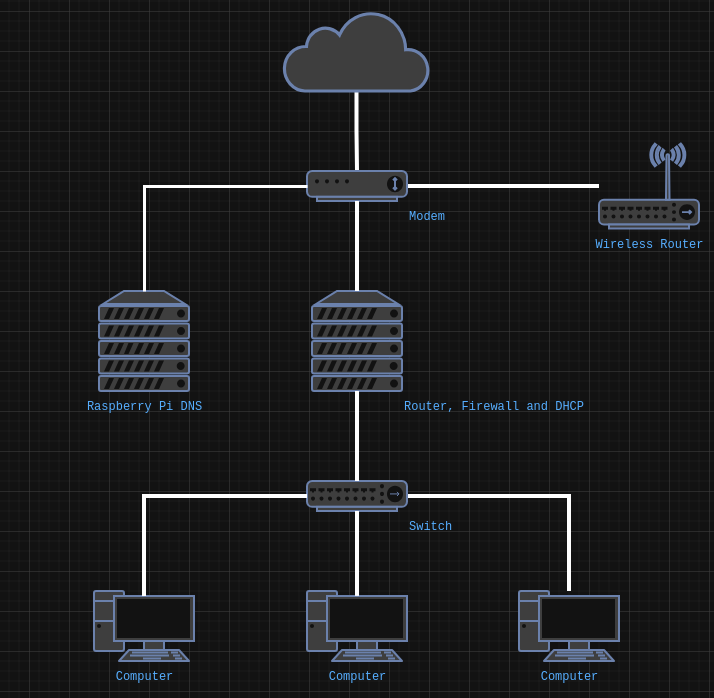

Title: Configurar Fedora Server 42 para compartir el acceso a internet
Slug: fedora-server-42-network-shared
Summary: Pasos para configurar un servidor con Fedora Server 42 para que sea un ruteador a internet con muro de fuego y servicio de DHCP.
Tags: fedora, network, servidores, software libre
Date: 2025-07-21 11:00
Modified: 2025-07-21 11:00
Category: apuntes
Preview: fedora-logo-icon.png


La Agencia de Seguridad Nacional de los EE.UU. / [National Security Agency](https://www.nsa.gov/) ha publicado [recomendaciones para incrementar la seguridad de las redes hogareñas](https://media.defense.gov/2023/Feb/22/2003165170/-1/-1/0/CSI_BEST_PRACTICES_FOR_SECURING_YOUR_HOME_NETWORK.PDF). Entre las que menciona la actualización regular del software tanto de las computadoras como de los dispositivos electrónicos (ruteadores, teléfonos inteligentes, tabletas, televisores, consolas, asistentes, etc.).

Debemos estar concientes de que todos estos aparatos que requieren conexión a internet también pueden enviar su información (actividad, voz y video) así como la que puedan averiguar de los dispositivos que estén en la misma red.

Vamos a describir un ejemplo de una situción de riesgo: supongamos que tenemos un televisor que puede visualizar fotos y reproducir música y videos desde la red local, así que habilitamos en nuestra computadora el acceso a los mismos... y en un descuido, sin contraseña y a todos los documentos personales. Como en muchas casas, en la misma red está un foco inteligente cuyo software nunca ha sido actualizado o que desde su fabricación viene programado para hacer rutinas de observación... y tal vez de recolección de datos de lo que encuentre en su red hogareña.

## Objetivo

Configurar un servidor con [Fedora Server 42](https://fedoraproject.org/server/) para que sea un ruteador a internet con muro de fuego y servicio de DHCP. Las características de este equipo son relativamente modestas:

- Procesador Intel Celeron J1800 2.4 GHz de dos núcleos
- RAM 4 GB
- SSD 64 GB SATA
- Dispositivo de red ethernet integrado de 1Gbit/s
- Dispositivo de red ethernet PCI de 1Gbit/s

También servirá para crear una red local cableada y separada de la red inalámbrica como se ilustra en este diagrama:



Un componente adicional es una [Raspberry Pi](https://www.raspberrypi.com/) con [Pi-Hole](https://pi-hole.net/) para que funcione como el DNS de las dos redes.

Comenzemos a partir de que ya tiene instalado Fedora Server 42 en el equipo.

## Actualizar Fedora Server

```sh
sudo dnf -y update
```

Instalar `lshw`

```sh
sudo dnf install lshw
```

Revisar los dispositivos de red

```sh
sudo lshw -class network
```

Para este equipo en particular

- `enp1s0` esta conectado a la red local y tendra la direccion IP estatica 10.11.11.1/24
- `enp4s0` conectado al modem hacia internet con la direccion IP 192.168.100.15/24

## Configurar los dispositivos con Network Manager

Revisar los dispositivos con Network Manager

```sh
nmcli device status
```

Revisar las direcciones IP

```sh
ip a
```

Renombrar la conexion al dispositivo que va a `internet`

```sh
nmcli conn mod enp4s0 connection.id internet
```

Agregar una nueva conexion **compartida** de nombre `local`

```sh
nmcli conn add type ethernet ifname enp1s0 ipv4.method shared con-name local
```

Donde el metodo `shared` hace que...

- Habilita **IP forwarding** en `enp1s0`
- Agrega las reglas al muro de fuego para habilitar el _masquerading_
- Arranca **dnasmasq** para ofrecer servicios de **DHCP** y **DNS**

Ver las conexiones resultantes

```sh
nmcli conn show
```

Ver la direccion IP

```sh
ip -o addr show enp1s0
```

Definir la direccion IP de `local` a 10.11.11.1/24

```sh
nmcli conn mod local ipv4.addresses 10.11.11.1/24
```

Levantar la conexion de nombre `local`

```sh
nmcli conn up local
```

Ver las conexiones para identificar la que no se use

```sh
nmcli conn
```

Eliminar la conexion no usada con su identificador

```sh
nmcli conn delete 259601a2-6e56-4e37-b4a0-8a1ea1c68787
```

## Configurar el muro de fuego

Ver las zonas

```sh
sudo firewall-cmd --get-active-zones
```

Debe mostrar estas dos zonas

- **FedoraServer** con el dispositivo `enp4s0` hacia `internet`
- **nm-shared** con el dispositivo `enp1s0` hacia la red `local`

Ver los servicios de la zona `nm-shared`

```sh
sudo firewall-cmd --zone=nm-shared --list-services
```

Agregar `cockpit` a los servicios de esa zona

```sh
sudo firewall-cmd --zone=nm-shared --add-service=cockpit
```

Ver los servicios de la zona `FedoraServer`

```sh
sudo firewall-cmd --zone=FedoraServer --list-services
```

Eliminar los servicios `cockpit` y `ssh` de esa zona

```sh
sudo firewall-cmd --zone=FedoraServer --remove-service=cockpit
sudo firewall-cmd --zone=FedoraServer --remove-service=ssh
```

Fijar todos los cambios para que sean permanantes

```sh
sudo firewall-cmd --runtime-to-permanent
```

## Configurar el servicio DHCP

Crear un archivo de configuracion

```sh
sudo nano /etc/NetworkManager/dnsmasq-shared.d/01-read-hosts.conf
```

Con este contenido

```ini
addn-hosts=/etc/hosts
```

Crear un archivo para configurar las direcciones IP estaticas con las `mac adresses` de los equipos en la red local

```sh
sudo nano /etc/NetworkManager/dnsmasq-shared.d/11-local-network.conf
```

Escribir una linea para cada _mac address_ y la direccion IP

```
dhcp-host=xx:xx:xx:xx:xx:xx,10.11.11.11
dhcp-host=xx:xx:xx:xx:xx:xx,10.11.11.12
dhcp-host=xx:xx:xx:xx:xx:xx,10.11.11.13
dhcp-host=xx:xx:xx:xx:xx:xx,10.11.11.14
```

Editar `/etc/hosts`

```sh
sudo nano /etc/hosts
```

Agregar una linea para cada direccion IP y el nombre de equipo en la red local

```
10.11.11.11  equipo1
10.11.11.12  equipo2
10.11.11.13  equipo3
10.11.11.14  equipo4
```

Reiniciar Network Manager para aplicar los cambios

```sh
sudo systemctl restart NetworkManager
```

## Configurar Pi-Hole en IP estatica en el dispositivo a internet

Para usar una Raspberry Pi con Pi-Hole como servidor DNS en la red que proporciona el internet he de cambiar...

Cambiar el metodo a manual

```sh
sudo nmcli con mod internet ipv4.method manual
```

Definir la direccion IP estatica del dispositivo que esta conectado al modem

```sh
sudo nmcli con mod internet ipv4.addresses 192.168.100.102/24
```

Definir el ruteador por defecto con la direccion IP del modem

```sh
sudo nmcli con mod internet ipv4.gateway 192.168.100.1
```

Definir la direccion IP del DNS hacia la Raspberry Pi

```sh
sudo nmcli con mod internet ipv4.dns 192.168.100.103
```

Ignorar los datos que sobre DNS vaya a proporcionar el modem

```sh
sudo nmcli con mod internet ipv4.ignore-auto-dns yes
```

Reiniciar Network Manager para aplicar los cambios

```sh
sudo systemctl restart NetworkManager
```

## Referencias

- [Internet connection sharing with NetworkManager](https://fedoramagazine.org/internet-connection-sharing-networkmanager/)
