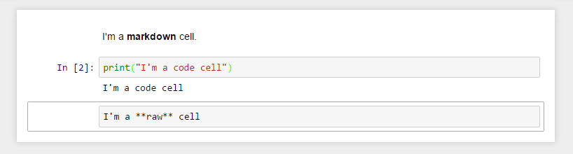

Title: Proyecto Jupyter (parte 1) Instalar
Slug: jupyter-taller-01-instalar
Summary: Taller sobre el proyecto Jupyter; en la primera parte se describe qué es y cómo instalarlo.
Tags: Python
Date: 2021-10-25 06:59:00
Modified: 2021-10-25 07:27:00
Category: Apuntes
Preview: jupiter.png

El [Proyecto Jupyter](https://jupyter.org/) es una organización sin ánimo de lucro creada para "desarrollar software de código abierto, estándares abiertos y servicios para computación interactiva en docenas de lenguajes de programación".

Creado a partir de IPython en 2014 por **Fernando Pérez,** el proyecto Jupyter soporta entornos de ejecución en varias docenas de lenguajes de programación. Los tres lenguajes de programación soportados por Jupyter son **Julia**, **Python** y **R**.

La filosofía operativa del Proyecto Jupyter es apoyar la ciencia de datos interactiva y la computación científica en todos los lenguajes de programación mediante el desarrollo de software de código abierto. Según el sitio web del Proyecto Jupyter, "Jupyter siempre será un software 100% de código abierto, de uso gratuito para todos y lanzado bajo los términos liberales de la licencia BSD modificada".

## Instalar IPython

Previamente debe tener instalado Python

    python -m venv venv
    . venv/bin/activate
    pip list
    pip install --upgrade pip
    pip install wheel
    pip install ipython

Para ejecutar

    ipython

## Instalar Jupyter Notebook

Comandos para instalar _notebook_

    python -m venv venv
    . venv/bin/activate
    pip list
    pip install --upgrade pip
    pip install wheel
    pip install notebook

Ejecute con...

    jupyter notebook

Se abrirá su navegador de internet con el _dashboard_ listo.

## Instalar JupyterLab

JupyterLab es un entrono de desarrollo en web para Jupyter notebooks, código y datos. JupyterLab es muy flexible: puede configurar flujos de trabajo para ciencia de datos, cómputo y aprendizaje de las máquinas. JupyterLab es modular: puede agregar componentes o escribirlos como plug-ins.

Para instalar ejecute estos comandos:

    python -m venv venv
    . venv/bin/activate
    pip list
    pip install --upgrade pip
    pip install wheel
    pip install jupyterlab

Ejecutar con...

    jupyter-lab

## Probar Jupyter Notebook sin instalar

Abra su navegador de internet y vaya a [https://jupyter.org/try](https://jupyter.org/try)

## Conozca Google Colaboratory

Con Google Chrome y tu cuenta Google ve a [colab.research.google.com/notebooks](https://colab.research.google.com/notebooks)

Los _notebooks_ se guardarán en Google Drive. Lee la [Introducción a Colab](https://colab.research.google.com/notebooks/welcome.ipynb?hl=es)

## El Dashboard

Cuando arranca por primera vez el servicio se muestra el Dashboard. El Dashboard es la página inicial del Notebook.

- Pestaña Files
- Pestaña Running
- Pestaña Clusters: requiere IPython Parallel

Botones

- New
- Upload

## Notebook

Los archivos notebook tienen la extensión **ipynb**. Al abrir un Notebook aparecerán...

**Header (cabecera):** menubar, toolbar

**Body (cuerpo):** donde encontrarás las celdas

+ Markdown cells
+ Code cells
+ Raw cells

Una celda puede tener dos modos

- **Modo edición:** borde azul, presione ENTER o de click en la celda
- **Modo comando:** borde verde, presiones ESC o de click fuera de la celda

## Atajos de teclado

