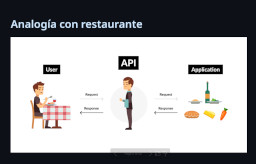
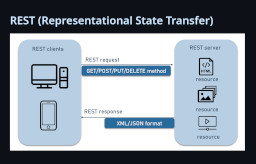
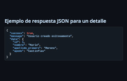

Title: Introducción a las APIs RESTful
Slug: introduccion-a-las-apis
Summary: Como parte de una serie de conferencias sobre seguridad informática elaboré este material para explicar el funcionamiento de las APIs, en particular la arquitectura RESTful.
Tags: desarrollo
Date: 2025-11-02 16:30
Modified: 2025-11-02 16:30
Category: presentaciones
Preview: preview.png

En esta presentación está el conocimiento básico que deseé saber hace años, cuando descubrí las APIs.

[De clic aquí para ver esta presentación](https://guivaloz.github.io/presentacion-introduccion-apis/) en el navegador de internet.

Los archivos fuente están en este [repositorio en GitHub](https://github.com/guivaloz/presentacion-introduccion-apis).
